# 🎨 GoBest — Frontend

> 🇬🇧 For English: [README.md](README.md)

**GoBest**'in web arayüzü — uçak, otobüs ve tren seferlerini birleştiren çok modlu bir seyahat rezervasyon platformu. Bu uygulama kullanıcı tarafıdır; [GoBest backend](https://github.com/sahinokdem/GoBestBackend) ile bir REST API üzerinden konuşur.

> Kısaca: rol bazlı bir seyahat rezervasyon arayüzü — müşteriler çok bacaklı rotaları arayıp satın alır, şirket yöneticileri (maintainer) kendi seferlerini yönetir, adminler platformun referans verisini yönetir.

---

## 🚀 Teknoloji

- **Framework:** Next.js 15 (App Router) + React 19
- **Dil:** TypeScript
- **Stil:** Tailwind CSS 4
- **Bileşenler:** shadcn/ui (Radix UI primitives)
- **Form & Doğrulama:** React Hook Form + Zod
- **Auth:** JWT tabanlı, rol farkındalıklı (Customer / Company Maintainer / Admin)

---

## 👥 Rol Bazlı Deneyim

GoBest üç rolü destekler, her birinin kendi arayüzü vardır.

### Customer — Ara & Satın Al

Müşteriler tüm ulaşım türlerini tek bir formdan arar (kalkış, varış, tarih, yolcu, mod) ve bir rota listesi alır — bacak bazlı detaylar ve koltuk tipi fiyatlarıyla birlikte **aktarmalı rota seçenekleri** dahil.

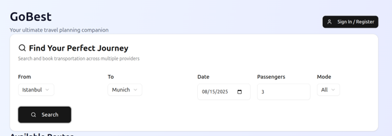

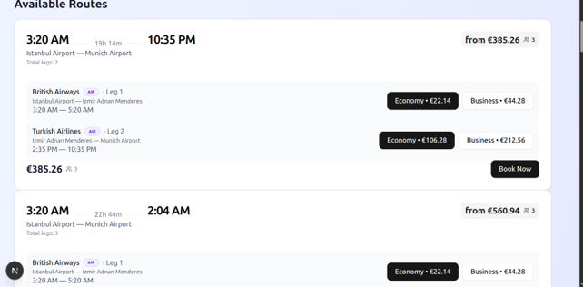

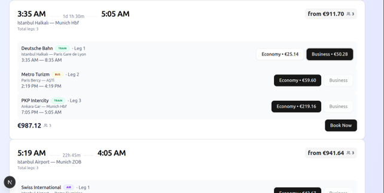

Satın almadan önce kimlik doğrulama, bir giriş / kayıt modal'ı üzerinden yapılır.

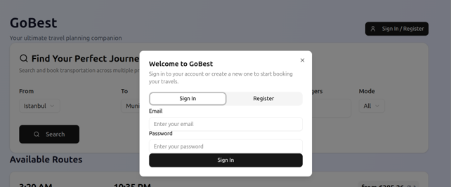

### Company Maintainer — Servis Yönetimi

Şirket yöneticileri kendi şirketlerinin bilgilerini ve sefer programlarını yönetir; kalkış/varış saatlerini ayarlamak için bir servis saati editörü dahil.

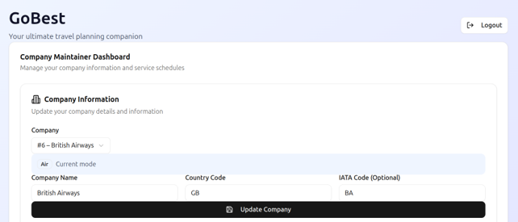

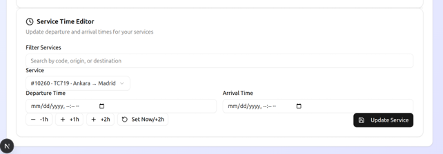

### Admin — Platform Verisi Yönetimi

Adminler platformun referans verisini yönetir — şirket yöneticisi (maintainer) oluşturma ve şirket, şehir, istasyon bilgilerini düzenleme (çoğu zaman harici servis API'sinden gelen eksik veriyi tamamlama).

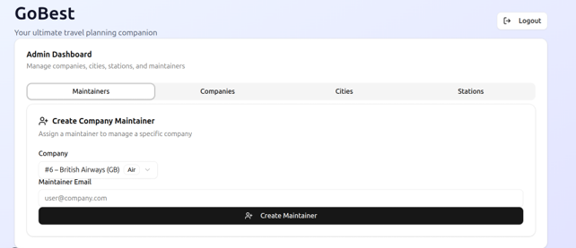

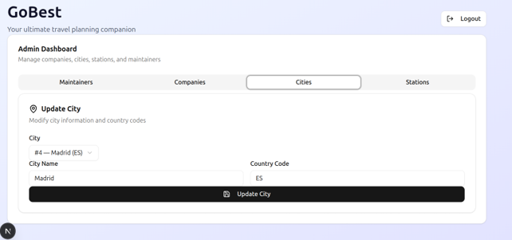

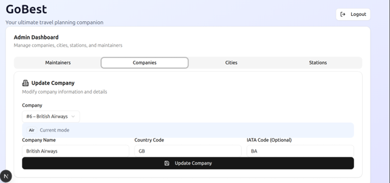

---

## 🎯 Landing

Landing sayfası ürünü ve temel değerini tanıtır: uçak, tren ve otobüsü tek yerde karşılaştırma ve esnek tarih araması.

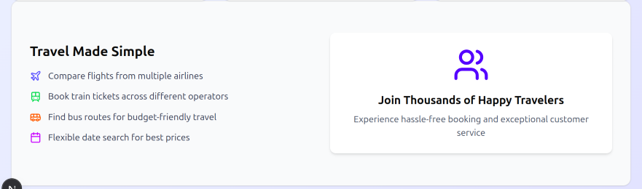

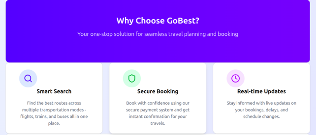

---

## 🛠️ Lokal Kurulum

```bash
npm install
npm run dev
```

Uygulama, [GoBest backend](https://github.com/sahinokdem/GoBestBackend)'in çalışıyor ve erişilebilir olmasını bekler; başlatmadan önce API adresini ilgili ortam değişkeniyle yapılandır.

Production build:

```bash
npm run build
npm run start
```
